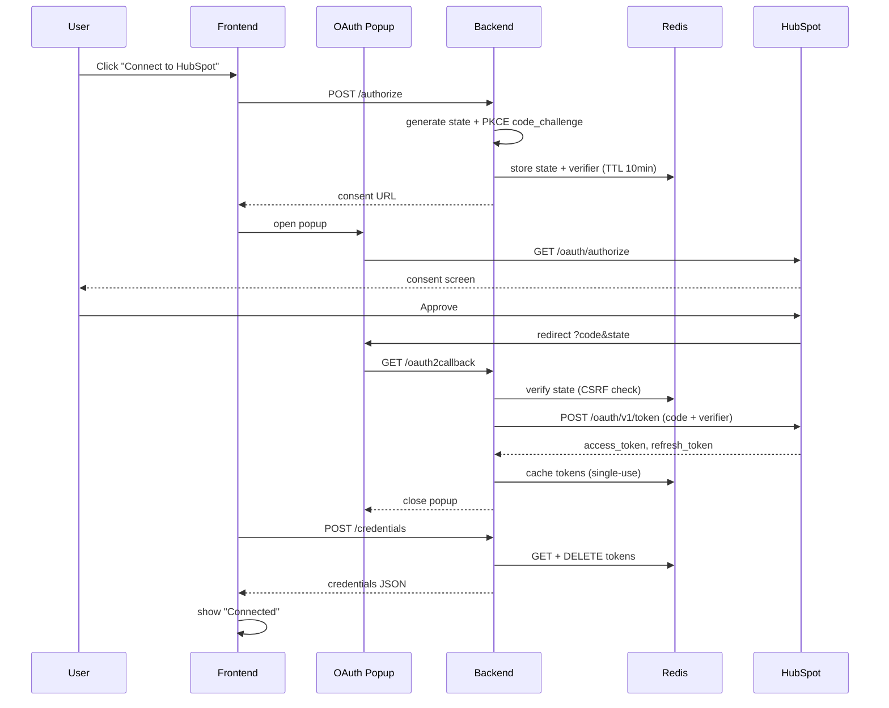
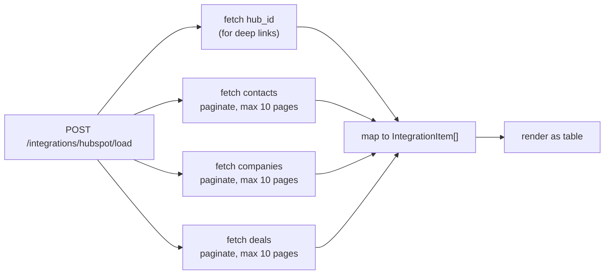

# Architecture

## System Overview

```mermaid
flowchart TB
    Browser["Browser (React + MUI)<br/>3-step stepper: details → connect → load"]

    Backend["FastAPI Backend :8000<br/>authorize_&#123;type&#125; · oauth2callback_&#123;type&#125;<br/>get_&#123;type&#125;_credentials · get_items_&#123;type&#125;"]

    Redis[("Redis<br/>sessions + tokens<br/>short TTL, single-use")]
    HubSpot["HubSpot API"]
    Airtable["Airtable API"]
    Notion["Notion API"]

    Browser <-->|"OAuth redirect, load data"| Backend
    Backend <--> Redis
    Backend <--> HubSpot
    Backend <--> Airtable
    Backend <--> Notion
```



All three integrations (HubSpot, Airtable, Notion) follow the identical
`authorize → callback → credentials → load` contract, so the frontend and
backend routing are shared — only the provider-specific API calls differ.

## OAuth 2.0 Flow (PKCE)



**Key decisions:**
- PKCE (RFC 7636) protects against token interception; backwards compatible with legacy HubSpot apps
- Single-use credentials prevent token leakage on retry
- State is CSRF protection (generated server-side, round-tripped through redirect, verified before token exchange)
- Redis (not in-memory) because popup and main window are separate HTTP requests

## Data Loading

**Concurrent fetch of three CRM object types (`asyncio.gather`):**



**Error handling:**
- **403 Forbidden** (missing scope) → Return empty list for that object type (graceful degradation)
- **401 Unauthorized** (bad token) → Raise HTTPException (not recoverable)
- **Name fallbacks** → Contact: full name → email → placeholder; Company: name → domain
- **Pagination** → Stop gracefully at max 10 pages (prevents runaway requests on large portals)

## Code Layout

**Backend:**
```
backend/
├── main.py                         # FastAPI routes, CORS
├── config.py                       # env loading, redirect_uri builder
├── integrations/
│   ├── integration_item.py         # shared data model
│   ├── hubspot.py                  # OAuth + CRM data loading
│   ├── airtable.py                 # Airtable (provided, secrets removed)
│   └── notion.py                   # Notion (provided, return fixed)
└── tests/
    └── test_hubspot.py             # 18 unit tests (offline)
```

**Frontend:**
```
frontend/src/
├── App.js                          # theme, dark mode
├── integration-form.js             # 3-step stepper
├── data-form.js                    # table with search/filter
├── components/
│   ├── AppHeader.js                # branding + dark mode toggle
│   └── ProviderCard.js             # visual provider picker
└── integrations/
    ├── integration-connect.js      # shared OAuth popup flow
    ├── provider-meta.js            # provider branding (colors, logos)
    ├── hubspot.js                  # thin wrapper
    ├── airtable.js                 # thin wrapper
    └── notion.js                   # thin wrapper
```

**Why extract `integration-connect.js`:**  
Original implementations had duplicated popup/poll/credentials logic. Centralizing it means:
- No code drift between providers
- A bug fix (e.g., null-popup guard) applies to all three
- Each provider file is now a 3-line wrapper

## IntegrationItem Data Model

All three providers (HubSpot, Airtable, Notion) map their records to a single `IntegrationItem` shape:

```
{
  id: "101_Contact",                           # provider id + type
  type: "Contact" / "Company" / "Deal",
  name: "John Doe",                            # with fallback chains
  creation_time: "2024-01-01T...",
  last_modified_time: "2024-08-14T...",
  parent_id: "contacts_collection",
  parent_path_or_name: "Contacts",             # collection name
  url: "https://app.hubspot.com/...",          # deep link
  directory: true,                             # true = collection, false = record
  children: 42,                                # child count (for collections)
  visibility: true,                            # false = archived
}
```

This unified model lets `data-form.js` render all three providers in a single table component.

## Key Design Decisions

1. **Async I/O** — All HTTP calls use `httpx.AsyncClient`, so the event loop is never blocked and three CRM types fetch in parallel
2. **PKCE** — Protects against token interception, backwards compatible with older HubSpot apps
3. **Single-use credentials** — Deleted from Redis after frontend retrieval to prevent leakage
4. **Code reuse** — Common OAuth flow extracted into one component (three integrations, zero duplication)
5. **Graceful degradation** — Missing scope on one object type = empty results for that type (not a full failure)
6. **Pagination guard rails** — Max 10 pages per object type prevents runaway requests on large portals
7. **Shared data model** — All providers map to `IntegrationItem`, so the table UI is provider-agnostic
