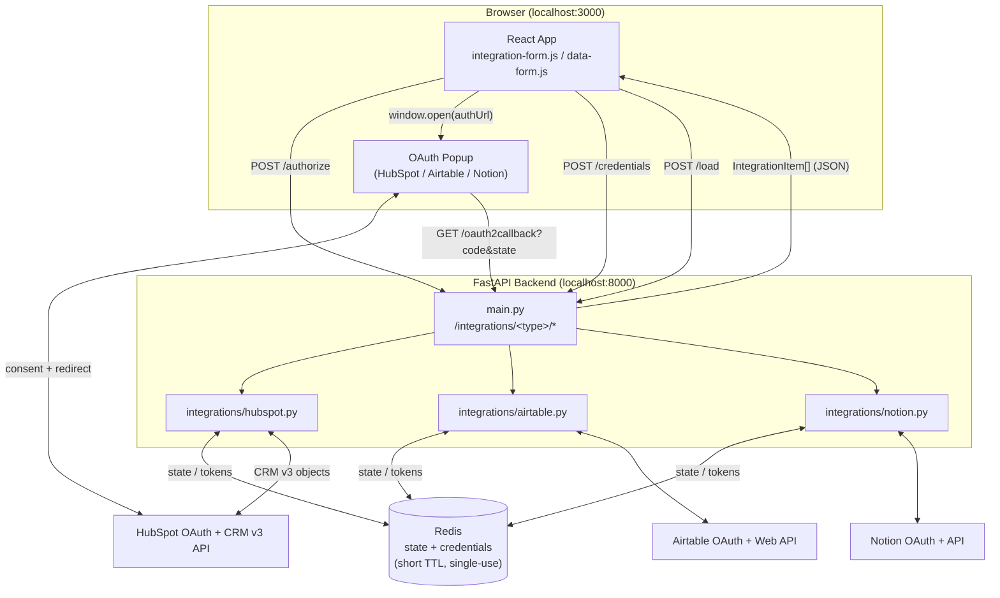
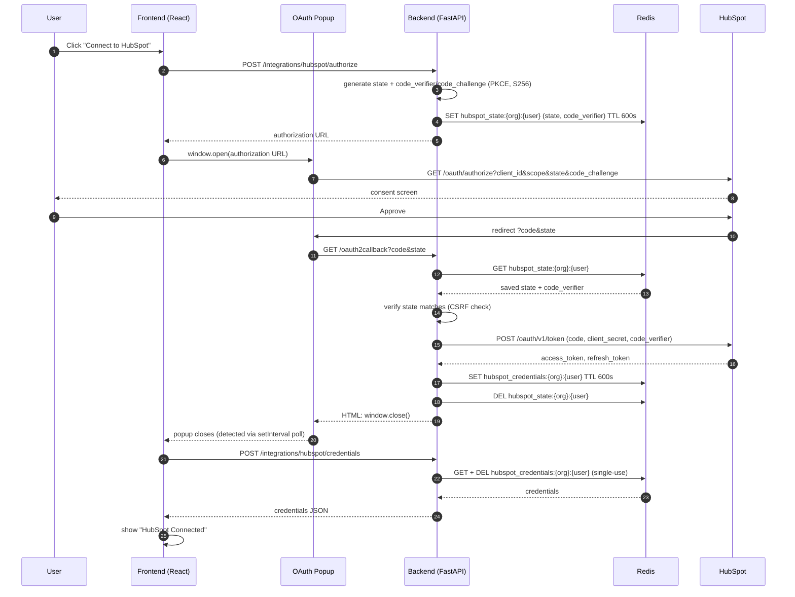
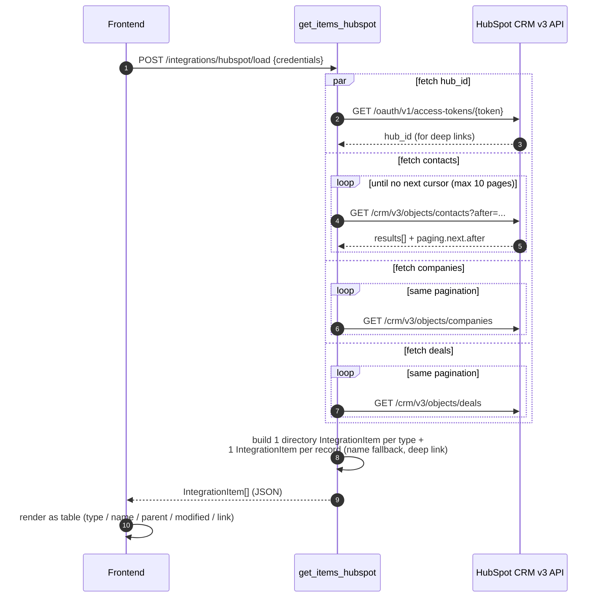
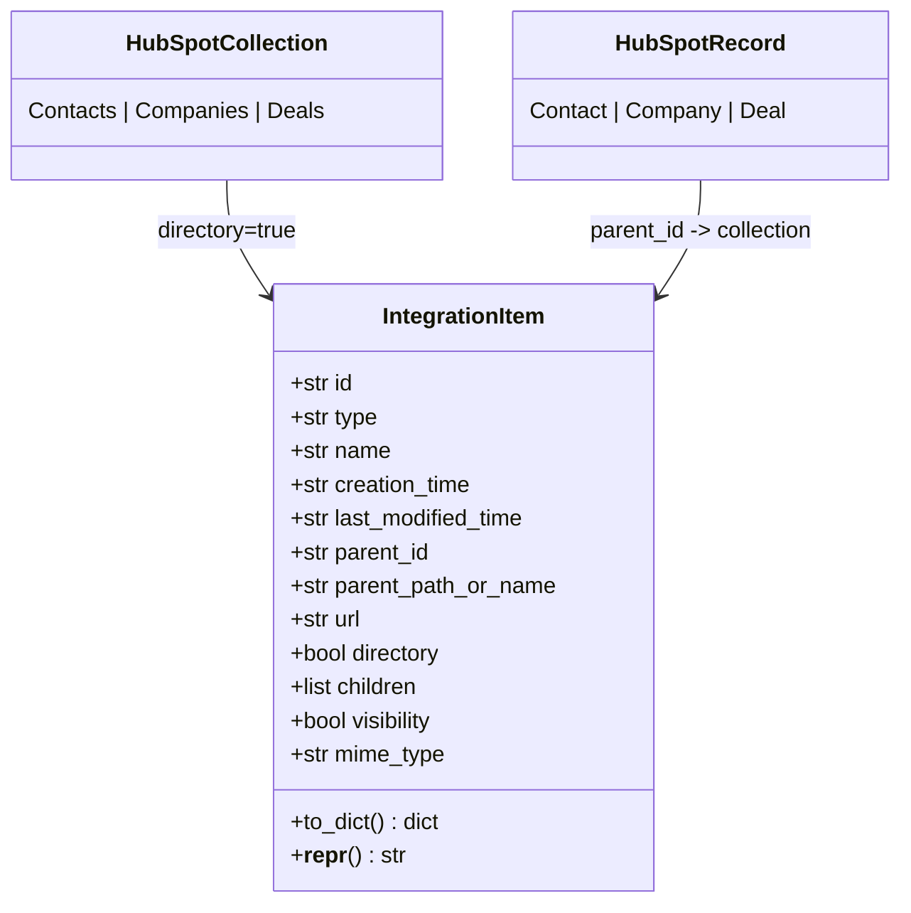

# Architecture

This document covers how the HubSpot integration fits into the existing Airtable/Notion
pattern, how data flows through the system, and the reasoning behind the structural
decisions made while building it.

---

## 1. System overview



**Why this shape:** every provider follows the identical four-step contract
(`authorize` → popup consent → `oauth2callback` → `credentials` → `load`), so the
frontend, routing, and storage layers are shared and provider modules only differ in
the HTTP calls they make. This is what let `hubspot.py` slot in next to
`airtable.py`/`notion.py` without touching `main.py`'s routing shape, and what let the
frontend's OAuth popup logic be extracted once and reused by all three
(`integration-connect.js`).

---

## 2. OAuth sequence (HubSpot, PKCE)



**Design notes:**
- **State is CSRF protection**, not the OAuth `code` — it's generated server-side,
  round-tripped through the redirect, and checked against Redis before any token
  exchange happens.
- **Credentials are single-use** (`GET` + `DEL` in one call) so a replayed
  `/credentials` request can't leak a stale token to a second caller.
- **PKCE is always generated**, even though it's optional on classic OAuth 2.0 apps —
  HubSpot's newer Projects-based apps run OAuth 2.1 and *require* it. Sending
  `code_challenge`/`code_verifier` unconditionally means the same code path works
  against both app generations without a feature flag.
- **Redis, not in-memory dicts**, because the popup and the main window are two
  different browser contexts hitting the backend as two separate HTTP requests —
  state has to survive between them and across FastAPI's auto-reload during dev.

---

## 3. Loading CRM items



**Design notes:**
- All four calls (hub lookup + 3 object types) run **concurrently** via
  `asyncio.gather`, not sequentially — the hub lookup is otherwise on the critical
  path for building record URLs but doesn't need to block object fetching.
- **Pagination is capped** at 10 pages per object type (1,000 records) so a very large
  portal can't turn one `/load` call into an unbounded request storm.
- **A `403` on one object type degrades gracefully** (returns an empty list for that
  type rather than failing the whole load) — a token with only `contacts.read`
  granted should still surface contacts instead of erroring out entirely. A `401`
  (bad/expired token) still raises, since that's not recoverable within the request.
- Each object type contributes one **directory item** (`Contacts`, `Companies`,
  `Deals`) followed by its records, so the shape mirrors Airtable's
  base → table → record hierarchy rather than inventing a new one.

---

## 4. Code layout

```
backend/
├── main.py                        # FastAPI routes: /integrations/{provider}/*
├── config.py                      # env var loading (get_env/require_env), redirect_uri()
├── redis_client.py                # thin Redis wrapper (add/get/delete)
└── integrations/
    ├── integration_item.py        # shared IntegrationItem dataclass-like model
    ├── airtable.py                # provided, fixed (secrets removed)
    ├── notion.py                  # provided, fixed (missing return)
    └── hubspot.py                 # built for this assessment
        ├── authorize_hubspot          # Part 1
        ├── oauth2callback_hubspot     # Part 1
        ├── get_hubspot_credentials    # Part 1
        ├── refresh_hubspot_token      # bonus
        └── get_items_hubspot          # Part 2
            ├── _fetch_hub_id
            ├── _fetch_all_records / _fetch_object_page   (pagination)
            ├── create_integration_item_metadata_object   (record -> IntegrationItem)
            └── _create_directory_item                    (collection -> IntegrationItem)

frontend/src/
├── config.js                          # API base URL + integration -> endpoint map
├── integration-form.js                # provider dropdown, wires up the selected integration
├── data-form.js                       # "Load Data" / renders IntegrationItem[] as a table
└── integrations/
    ├── integration-connect.js         # shared connect/popup/poll/credentials logic
    ├── airtable.js / notion.js        # thin wrappers around integration-connect.js
    └── hubspot.js                     # built for this assessment (same pattern)
```

**Why extract `integration-connect.js`:** the original `airtable.js`/`notion.js` each
duplicated the full popup-open / poll-for-close / fetch-credentials sequence. Writing
`hubspot.js` as a third copy would have meant three near-identical implementations
drifting independently (which is exactly what caused the popup-blocked race condition
fixed along the way — see README). Centralizing it means a fix or improvement (like
the null-popup guard) applies to all three providers at once, and `hubspot.js` itself
is a 3-line wrapper.

---

## 5. Data model



One shared `IntegrationItem` shape is used across all three providers, which is what
lets `data-form.js` render Airtable, Notion, and HubSpot results in the same table
component without a provider-specific renderer.

---

See [README.md](README.md) for setup instructions and the full list of fixes made to
the provided code.
